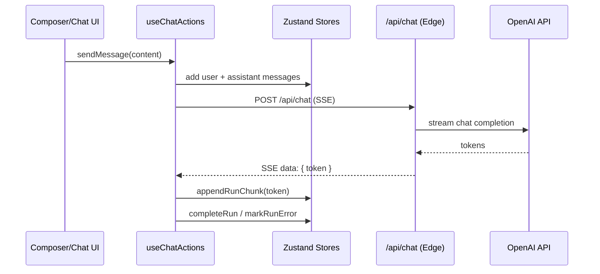

# Multi-Model AI Workspace - Technical Documentation

This document summarizes the current implementation, architecture, and major systems in this project. It is based on the code present in the repository and is intended to explain what has been built and how it works.

## Overview

Multi-Model AI is a Next.js (App Router) chat workspace that supports multi-model responses, per-model runs, streaming output, and a modular state architecture. It includes demo authentication, billing/usage scaffolding, and a UI modeled after modern AI chat products.

## Stack

- Next.js `^16.1.6` (App Router, Edge runtime for streaming API)
- React `19.2.3`
- TypeScript `^5`
- Zustand `^4.5.2` for state management (with `localStorage` persistence)
- Tailwind CSS `^3.4.14` for styling
- Radix UI primitives + shadcn/ui components
- NextAuth `^5.0.0-beta.30` for authentication
- Vitest + Testing Library for unit tests
- Playwright for e2e smoke tests

## What Has Been Built

- Multi-model chat UI with per-model runs and statuses
- Streaming responses from the OpenAI API through a server-side proxy
- Split Zustand stores for conversations, models, settings, and streams
- Backwards-compatibility wrapper (`lib/store.ts`) for older UI usage
- Message editing + retry flows
- Sources and disagreements UI (data model + dialogs wired)
- Billing and usage scaffolding (plans, credits, cost estimation)
- Demo authentication with NextAuth Credentials + middleware protection
- Error boundaries for application and chat-specific recovery
- Unit tests for the conversation store and a Playwright smoke test

## App Structure

- `app/`
  - `(shell)/` route group for the main app layout
  - `api/chat/route.ts` OpenAI streaming proxy (Edge runtime)
  - `auth/login` demo login page
  - `intro`, `about`, `pricing`, `projects`, `account`, `support` pages
- `components/`
  - Chat UI (MessageItem, MessageList, Composer, SettingsDrawer, dialogs)
  - Sidebar + mobile sidebar
  - Billing modals
  - UI primitives (`components/ui/*`)
- `lib/`
  - `api/` OpenAI streaming client
  - `stores/` split Zustand stores
  - `hooks/` chat orchestration hook
  - `billing/` plans, costs, credits
  - `analytics/` usage tracking stubs
  - `auth.ts` NextAuth configuration
  - `modelCatalog.ts` model metadata and default slots
  - `types.ts` shared domain types
- `lib/store.old.ts` and `lib/mockStream.ts`
  - Legacy mock streaming flow retained for reference

## Core Architecture

### High-Level Flow

1. User sends a message in `Composer`.
2. `useChatActions.sendMessage` creates a user message, pre-allocates assistant runs, and builds API history.
3. For each enabled model slot, a streaming request is sent to `/api/chat`.
4. SSE tokens are appended to the corresponding run in `conversationStore`.
5. Runs are finalized or marked as error; slot statuses and usage records are updated.

### State Management

State is split into focused stores under `lib/stores/`:

- `conversationStore.ts`
  - Conversations, messages, runs
  - Message editing and run updates
  - Persistence key: `multi-model-conversations`
- `modelStore.ts`
  - Active model slots, enabled flags, statuses
  - Persistence key: `multi-model-slots`
- `settingsStore.ts`
  - Interaction mode and system instructions
  - Persistence key: `multi-model-settings`
- `streamStore.ts`
  - AbortControllers per run for cancellation

A compatibility wrapper in `lib/store.ts` mirrors the old `useChatStore` API to support gradual migration.

### Message Rendering

- `components/chat/MessageItem.tsx`
  - Markdown rendering with `react-markdown` + `remark-gfm`
  - Code blocks with Prism and copy-to-clipboard
  - Message editing and resend flows
- `components/chat/MessageList.tsx`
  - Scrollable chat list with sticky-to-bottom behavior
  - Per-slot run selection based on active model tab
- `components/VirtualizedChatThread.tsx`
  - Optional windowed rendering via `@tanstack/react-virtual`

### API Layer

- `app/api/chat/route.ts`
  - Edge runtime SSE proxy that streams tokens to the client
  - Validates request shape and API key presence
- `lib/api/openai.ts`
  - Streams OpenAI chat completion tokens using `fetch`
  - Maps internal model IDs to OpenAI model names

Only OpenAI is wired in the API implementation; other providers are listed in the catalog but not yet connected.

### Models and Slots

- `lib/modelCatalog.ts` defines providers and model metadata
- `DEFAULT_SLOT_MODEL_IDS` seeds the initial slots
- Slots are editable and toggleable, with at least one slot enforced

### Billing and Usage

- `lib/billing/*` implements plan definitions, credit balances, and pricing estimation
- `estimateChatCostForSlots` is used before sending a message
- `useBillingStore` handles credit spend, top-ups, and modals
- Costs are estimates only; no real billing integration is present

### Analytics

- `lib/analytics/index.ts` provides a stub analytics service
- `lib/analytics/usage.ts` tracks per-model usage with `localStorage` persistence

### Authentication

- NextAuth credentials provider with demo user
- `middleware.ts` redirects unauthenticated users to `/auth/login`
- Demo credentials are shown on the login page

## Deployment

**Production URL:** https://multimodel-ai.vercel.app

The application is deployed on Vercel with the following configuration:

- **Project:** `multimodel-ai`
- **Framework:** Next.js 16 (auto-detected)
- **Build Command:** `prisma generate && next build`
- **Runtime:** Node.js (for auth/database compatibility)

### Required Environment Variables (Vercel)

| Variable | Description |
|----------|-------------|
| `AUTH_SECRET` | NextAuth secret for session encryption |
| `OPENAI_API_KEY` | OpenAI API key for chat completions |

### Optional Environment Variables

| Variable | Description |
|----------|-------------|
| `DATABASE_URL` | PostgreSQL URL (required for OAuth persistence) |
| `GOOGLE_CLIENT_ID` | Google OAuth client ID |
| `GOOGLE_CLIENT_SECRET` | Google OAuth client secret |
| `SENTRY_DSN` | Sentry error tracking DSN |

## Environment Variables (Local)

Defined in `.env.example`:

- `OPENAI_API_KEY` (required for real streaming)
- `NEXT_PUBLIC_APP_URL`
- `NEXT_PUBLIC_DEBUG` (enables analytics debug logging)
- `AUTH_SECRET` (NextAuth)
- Placeholder keys for other providers

## Testing

- Unit tests: `lib/stores/__tests__/conversationStore.test.ts`
- Test setup: `test/setup.ts`
- E2E: `e2e/smoke.spec.ts` uses Playwright

Scripts:

- `npm run test` (Vitest)
- `npm run e2e` (Playwright)
- `npm run lint` (ESLint)

## Known Limitations / Placeholders

- Only OpenAI is integrated for real streaming. Other providers are catalog-only.
- Sources/disagreements are modeled in types and UI but not generated by the live API.
- Some legacy state and mock streaming artifacts remain (`lib/store.old.ts`, `lib/mockStream.ts`).

## Implementation Notes

- The API route uses SSE (`text/event-stream`) and the Edge runtime for low-latency streaming.
- `useChatActions` estimates token usage by character count (`~4 chars per token`).
- In `ensemble`/`debate` modes, a placeholder unified response is generated client-side.
- `localStorage` persistence is used for all client state; server-side data storage is not yet implemented.

## Suggested Next Steps (If Desired)

- Integrate additional providers (Anthropic, Google, xAI) in `lib/api/`
- Generate sources/disagreements for real runs
- Replace demo auth with real user persistence
- Add more unit tests for `modelStore` and `settingsStore`
- Enable virtualized chat thread for large conversation histories
