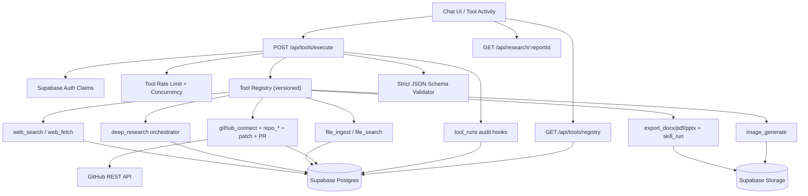

# Tool Framework Implementation (Next.js + Supabase)

## 1) Architecture Diagram



## 2) API Contracts

### GET `/api/tools/registry`
- Auth required.
- Response:
```json
{
  "requestId": "string",
  "tools": [
    {
      "tool_name": "string",
      "tool_version": "string",
      "description": "string",
      "input_schema": {},
      "output_schema": {},
      "permissions": ["web:read"],
      "estimated_cost": {},
      "changelog": "string",
      "deprecated_at": null
    }
  ]
}
```

### POST `/api/tools/execute`
- Auth required.
- Input:
```json
{
  "tool_name": "web_search",
  "tool_version": "1.0.0",
  "input": {},
  "idempotency_key": "optional-string",
  "require_confirmation": false,
  "confirmation_token": "optional",
  "project_id": "uuid-or-null",
  "conversation_id": "uuid-or-null",
  "message_id": "uuid-or-null"
}
```
- `require_confirmation` is UI-only metadata; server enforcement is based on tool definition flags.
- Response:
```json
{
  "requestId": "string",
  "run_id": "uuid",
  "tool_name": "string",
  "tool_version": "string",
  "output": {},
  "cost": {},
  "from_idempotency_cache": false
}
```
- On write tools without valid confirmation token, API returns `409 CONFIRMATION_REQUIRED` with `details.confirmation_token` and `details.expires_at`.

### GET `/api/research/:reportId`
- Auth required; RLS-protected.
- Response:
```json
{
  "requestId": "string",
  "report": {},
  "sources": [],
  "trace": {}
}
```

## 2.1) Minimal UI Flows (Implemented)

- Chat message tool activity:
  - `components/chat/MessageItem.tsx` now renders per-tool run status, cost, sources, artifact chips, and errors when `message.toolCalls` is present.
- Research retrieval:
  - UI can open report/source/trace using `GET /api/research/:reportId`.
- Artifact visibility:
  - export/image tools persist rows in `artifacts`; UI can map `toolCalls[].artifacts` to download links.
- Cursor-like GitHub flow:
  - client executes staged tools (`github_connect_repo` -> `repo_index` -> `repo_search/repo_read_file` -> `propose_patch` -> `apply_patch` -> `run_checks` -> `create_pull_request`) with explicit confirmations on write actions.

## 3) DB Schema (Implemented)

Migration: `supabase/migrations/20260226101500_tool_framework.sql`

### Core tables
- `tool_registry`:
  - `tool_name`, `tool_version`, `description`, `input_schema`, `output_schema`, `permissions`, `estimated_cost`, `changelog`, `deprecated_at`
  - PK: `(tool_name, tool_version)`
- `tool_runs`:
  - audit columns: `caller_user_id`, `workspace_id`, `project_id`, `tool_name`, `tool_version`, `input_hash`, `output_hash`, `duration_ms`, `status`, `error_*`, payload snapshots
  - null-safe scope key: `project_scope_key = coalesce(project_id::text,'**null**')`
  - unique idempotency: `(caller_user_id, project_scope_key, tool_name, tool_version, idempotency_key)` filtered non-null

### Web/deep research
- `web_search_cache`
- `web_pages_cache` (+ FTS index on `clean_text`)
- both cache tables now use `project_scope_key` for null-safe workspace+project uniqueness
- `research_reports`
- `research_sources`
- `research_traces`

### Files/retrieval
- `files` (+ FTS index on `parsed_text`)
- `file_chunks` (+ FTS index on `chunk_text`)
- `file_embeddings` (double precision[] for optional embedding storage)

### Artifacts/exports/images
- `artifacts` (docx/pdf/pptx/image storage references)

### Integrations/GitHub
- `integrations` (encrypted tokens)
- `repos`
- `repo_files_cache` (+ FTS)
- `repo_index_jobs`
- `repo_embeddings`

### RLS notes
- Workspace/project scoped via `public.user_has_workspace_access(workspace_id)`.
- Creator-bound writes for sensitive rows (`tool_runs`, `research_reports`, `artifacts`, `integrations`, etc.).
- `tool_registry` readable to authenticated; writes blocked from normal clients.

## 4) Tool Registry Spec + Example Tool Definitions

Registry interface is implemented in `lib/tools/types.ts`, `lib/tools/registry.ts`, `lib/tools/executor.ts`.
Each tool definition includes:
- `tool_name` (snake_case)
- `tool_version`
- `description`
- `input_schema` (strict JSON Schema)
- `output_schema` (strict JSON Schema)
- `permissions`
- `estimated_cost`
- optional `requires_confirmation` (server-enforced for write actions)
- `changelog`
- optional `deprecated_at`
- `execute(context, input)`

Implemented tools (v1.0.0):
- Web: `web_search`, `web_fetch`
- Research: `deep_research`
- Images: `image_generate`
- Files: `file_ingest`, `file_search`
- Export: `export_docx`, `export_pdf`, `export_pptx`, `skill_run`
- GitHub: `github_connect_repo`, `repo_index`, `repo_list_files`, `repo_read_file`, `repo_search`, `propose_patch`, `apply_patch`, `run_checks`, `create_pull_request`

Example invocation pattern (all tools use `POST /api/tools/execute`):
```json
{
  "tool_name": "web_search",
  "tool_version": "1.0.0",
  "project_id": "uuid",
  "input": {
    "query": "supabase row level security best practices",
    "top_k": 5
  }
}
```

Tool IO summary:
- `web_search`: query options -> ranked result list with `canonical_url`.
- `web_fetch`: url -> `clean_text`, `headings`, metadata, hash, word count.
- `deep_research`: topic/options -> report markdown + citations + source bundle + trace + report id.
- `image_generate`: prompt/options -> created image artifact refs.
- `file_ingest`: file pointer -> parsed refs, metadata, content hash, chunk refs.
- `file_search`: query/scope/filters -> scored chunk matches + references.
- `export_docx/pdf/pptx`: content payload -> downloadable artifact refs.
- `skill_run`: skill request -> skill runner output envelope.
- `github_connect_repo`: repo + token -> `repo_id`, `integration_id`.
- `repo_index`: repo/branch -> indexed file count.
- `repo_list_files`: repo/branch/path/glob -> cached file manifest.
- `repo_read_file`: repo/path -> file content + sha (secret-redacted).
- `repo_search`: repo/query -> scored snippets.
- `propose_patch`: unified diff + rationale -> stats + warnings.
- `apply_patch`: approved diff apply -> commit results.
- `run_checks`: repo/branch -> CI check summary.
- `create_pull_request`: approved PR request -> PR metadata.

## 5) Phased Build Plan

### Phase 1 (implemented)
- Tool framework core (registry + schema validation + audit + rate limit + idempotency)
- `web_search` + `web_fetch`
- caching (`web_search_cache`, `web_pages_cache`)
- `tool_runs` audit logging

### Phase 2 (implemented)
- `deep_research` orchestrator
- source scoring, conflicts/uncertainty capture
- citations/source bundle/trace persistence
- report retrieval route

### Phase 3 (implemented)
- `file_ingest` for txt/md/csv/json/docx/pdf/pptx/xlsx (best-effort)
- stable chunk IDs (hash-based)
- `file_search` with scoped filters and reference metadata

### Phase 4 (implemented)
- `export_docx`, `export_pdf`, `export_pptx`
- `skill_run` wrapper
- artifact storage linking via `artifacts`

### Phase 5 (implemented)
- `image_generate` with OpenAI image API
- storage + metadata tracking in `artifacts`

### Phase 6 (implemented)
- GitHub repo connect (encrypted token storage)
- indexing cache + file listing/reading/search
- patch proposal + guarded apply + checks + PR creation
- protected branch block + pre-write secret scan

## 6) Test Plan

### Unit tests
- Schema validator:
  - accepts valid payloads, rejects shape drift
- Diff applier:
  - hunk context match/mismatch, add/delete/modify cases
- Citation linking:
  - citations are stable IDs and mapped to report sections
- Secret scanning/redaction:
  - OpenAI/GitHub/private key patterns

### Integration tests
- Tool execution API:
  - auth, rate-limit, idempotency replay, audit row states
- Deep research:
  - persists report + sources + trace
- File ingest/search:
  - per-file references (page/slide/paragraph)
- GitHub flow:
  - connect repo, index, read/search, propose/apply patch (approved), create PR

### Security tests
- RLS boundaries across workspace/project
- Redaction in audit payloads/log context
- Write-action approval enforcement (`approved` + note)
- Secret block before patch apply and before PR creation

## 7) Security + Correctness Checklist

- [x] Server-enforced confirmation:
  - write tools (`github_connect_repo`, `apply_patch`, `create_pull_request`) require server-issued confirmation challenge token.
  - client `require_confirmation` field cannot bypass enforcement.
- [x] Confirmation challenge:
  - token is bound to `tool_name`, `tool_version`, `input_hash`, `user_id`, `project_scope_key`, and expiry.
  - invalid/expired token is rejected.
- [x] Idempotency correctness:
  - lookup matches `tool_name + tool_version + input_hash + idempotency_key`.
  - reused key with different input returns `409 IDEMPOTENCY_KEY_REUSED_WITH_DIFFERENT_INPUT`.
  - null `project_id` handled through `project_scope_key`.
- [x] Timeout correctness:
  - timeout wrapper clears timers in all paths.
  - per-run `AbortController` signal is passed in tool context.
- [x] No post-timeout leak path:
  - timeout path aborts in-flight fetch-based work via `abortSignal`.
- [x] Registry sync hot-path guard:
  - DB sync is gated by in-memory TTL and in-flight de-duplication.
- [x] SSRF hardening (`web_fetch`):
  - only `http/https`, no URL userinfo.
  - DNS resolution required; private/local/reserved IPv4/IPv6 blocked.
  - redirect chain re-validates URL and host safety each hop.
- [x] DoS hardening (`web_fetch`):
  - max redirect count.
  - strict content-type allowlist (`text/html`, `application/xhtml+xml`).
  - streaming response size cap with early abort (`TOOL_FETCH_TOO_LARGE`).
- [x] Cache consistency:
  - `web_search_cache` and `web_pages_cache` read keys, unique indexes, and upsert conflicts aligned to workspace+project scope.
  - `maybeSingle()` now reads on unique predicates.
- [x] Recency behavior:
  - `web_search` uses best-effort query modifiers for `recency_days`.
  - `deep_research` adds year hints and source-recency scoring.
- [x] Targeted tests added:
  - executor confirmation enforcement/idempotency version/hash/null-scope.
  - web fetch SSRF blocks + DNS private resolution + response size limit.

## 8) Deferred (Explicit)

- True async worker execution for long operations (`repo_index_jobs`, deep research, large file ingestion) using a dedicated queue/worker runtime; current implementation runs in request lifecycle.
- OCR pipeline for scanned PDFs and image-captioning extraction for `file_ingest` images.
- Semantic retrieval using pgvector for `file_embeddings` and `repo_embeddings` (schema exists; runtime indexing/search is keyword-first).
- GitHub OAuth App installation UX and token refresh automation; current connect flow accepts token input and stores it encrypted.
- `image_edit` tool (optional in scope) is not yet implemented.
- Rich “tool trace UI timeline” and artifact/source cards are partially modeled in message tool calls but not fully wired to a dedicated client data-fetch flow.
- Automated rollback helpers for repo write actions (git history is preserved; one-click revert flow not yet implemented).
